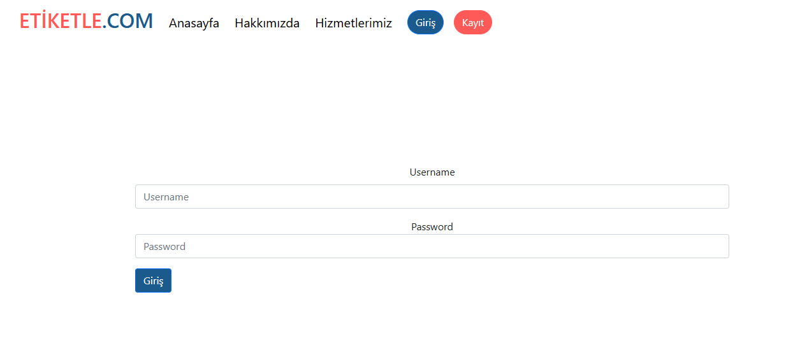

# etiketle
Etiketle is a data labeling site. Python fastapi is used in the backend, and also Mongodb is chosen as a database.  HTML, CSS, JavaScript is used on the frontend

## Index Page

## Login Page
